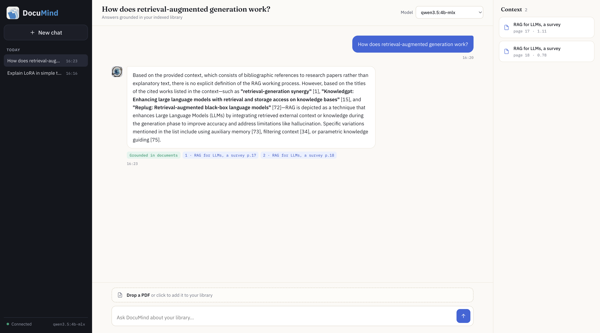
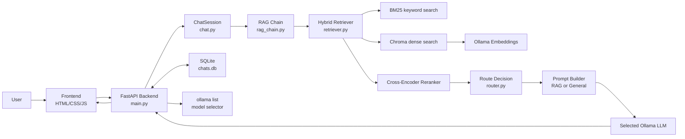
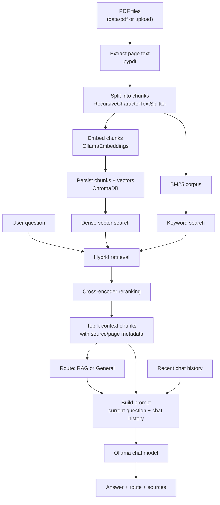
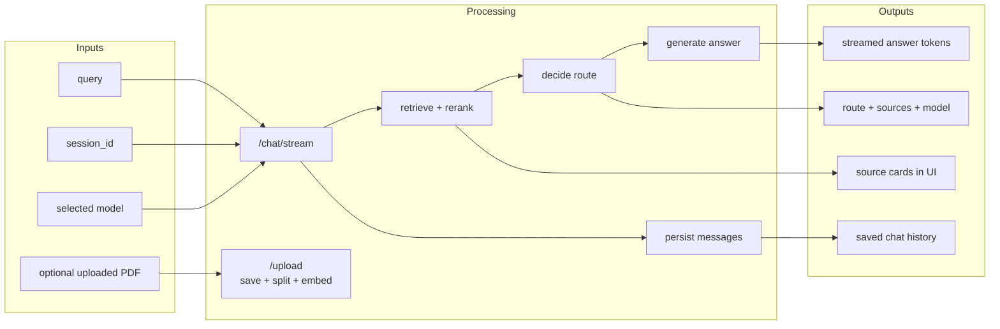
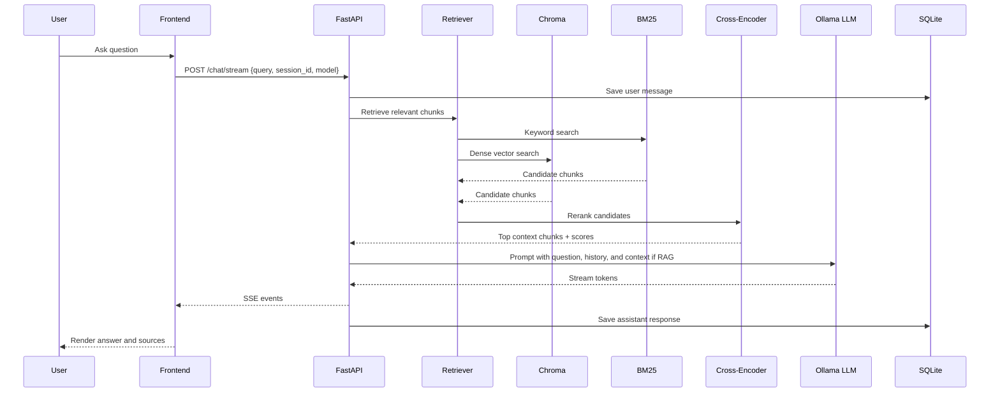

# DocuMind AI - Hybrid RAG Chat System

DocuMind AI is a local Retrieval-Augmented Generation (RAG) chat application for asking questions over a PDF library. It combines keyword retrieval, dense vector retrieval, cross-encoder reranking, route selection, multi-turn chat memory, model switching through Ollama, and a browser-based chat UI.

The system is designed for research-paper question answering, but the same architecture can be used for any PDF corpus.

## Outputs
<p>
  
  
</p>

## Features

- PDF ingestion into a persistent Chroma vector database
- Recursive text chunking with configurable chunk size and overlap
- Ollama embeddings for dense retrieval
- BM25 keyword retrieval
- Hybrid retrieval through LangChain `EnsembleRetriever`
- Cross-encoder reranking with relevance scores
- Automatic routing between document-grounded RAG answers and general answers
- Streaming chat responses through FastAPI Server-Sent Events
- Multi-turn conversation memory within each chat
- Chat history persistence with SQLite
- Runtime LLM selection from `ollama list`
- Frontend PDF upload and source display
- RAGAS evaluation dataset and runner under `eval/`

## Repository Structure

```text
RAG_system/
├── data/pdf/                 # Main PDF corpus
├── ragas_data/               # PDFs used for RAGAS sample dataset generation
├── chroma_db/                # Persisted Chroma vector database
├── frontend/                 # Static browser UI
├── images/                   # Logo and avatar assets
├── eval/                     # RAGAS dataset, evaluation script, guide
├── main.py                   # FastAPI app and HTTP/SSE endpoints
├── ingest.py                 # PDF loading, chunking, and Chroma ingestion
├── vectorstore.py            # Chroma and Ollama embedding helpers
├── retriever.py              # BM25 + dense hybrid retrieval + reranking
├── router.py                 # RAG vs general route decision
├── rag_chain.py              # Prompt construction and LLM calls
├── chat.py                   # Conversation memory wrapper
├── database.py               # SQLite chat persistence
├── config.py                 # Models, paths, chunking, retrieval settings
└── requirements.txt
```

## Architecture



## Data Flow



## Input / Output Flow



## Retrieval Pipeline



## Prerequisites

- Python 3.11+
- Ollama installed and running
- At least one chat model installed in Ollama
- One embedding model installed in Ollama

Example Ollama models:

```bash
ollama pull qwen3.5:4b-mlx
ollama pull qwen3-embedding:0.6b
```

Start Ollama:

```bash
ollama serve
```

## Installation

```bash
git clone <your-repo-url>
cd RAG_system

python -m venv venv
source venv/bin/activate

pip install -r requirements.txt
```

## Configuration

Main settings are in `config.py`:

```python
pdf_dir = Path("data/pdf")
chroma_dir = Path("chroma_db")
ollama_url = "http://localhost:11434"
llm_model = "qwen3.5:4b-mlx"
embed_model = "qwen3-embedding:0.6b"
chunk_size = 1000
chunk_overlap = 200
candidate_k = 20
rerank_top_k = 5
relevance_threshold = 0.3
```

Change these values before ingestion if you want a different embedding model, chunking strategy, or Chroma collection.

## Ingest PDFs

Place PDF files in:

```text
data/pdf/
```

Then start the app. If the retriever is not ready, startup attempts ingestion automatically. You can also call:

```bash
curl -X POST http://127.0.0.1:5000/ingest
```

Uploaded PDFs from the frontend are saved into `data/pdf/`, split, embedded, and added to Chroma.

## Run the App

```bash
uvicorn main:app --host 127.0.0.1 --port 5000 --reload
```

Open:

```text
http://127.0.0.1:5000
```

## API Endpoints

| Endpoint | Method | Purpose |
|---|---:|---|
| `/` | GET | Serves the frontend |
| `/health` | GET | Health check and configured models |
| `/models` | GET | Lists available Ollama chat models, sorted alphabetically |
| `/chat` | POST | Non-streaming chat response |
| `/chat/stream` | POST | Streaming chat response through SSE |
| `/upload` | POST | Upload and ingest a PDF |
| `/ingest` | POST | Ingest all PDFs from `data/pdf` |
| `/chats` | GET | List saved chats |
| `/chats/{chat_id}` | GET | Get messages for one chat |
| `/chats/{chat_id}` | DELETE | Delete a chat |

Example chat request:

```bash
curl -X POST http://127.0.0.1:5000/chat \
  -H "Content-Type: application/json" \
  -d '{
    "query": "What is LoRA?",
    "session_id": "demo",
    "model": "qwen3.5:4b-mlx"
  }'
```

Example response:

```json
{
  "answer": "LoRA is a parameter-efficient fine-tuning method...",
  "route": "rag",
  "sources": [
    {
      "source": "LORA, Low Rank Adaptation of LLMs.pdf",
      "page": 1,
      "score": 0.82
    }
  ]
}
```

## Model Switching

The frontend calls:

```text
GET /models
```

The backend reads `ollama list`, filters out embedding models, sorts chat models alphabetically, and returns them to the model selector. Each chat request includes the selected model, so you can switch LLMs within the same conversation.

## Chat Memory

Each chat has a `ChatSession` with recent conversation history. The system keeps the latest messages and includes them in prompt construction for both RAG and general responses. Saved chats are persisted in SQLite and rehydrated into memory when opened again.

## RAGAS Evaluation

Evaluation assets live under `eval/`:

```text
eval/
├── build_ragas_dataset.py
├── ragas_sample_dataset.csv
├── ragas_evaluate.py
└── RAGAS.md
```

Install RAGAS dependencies if needed:

```bash
venv/bin/pip install ragas datasets
```

Run a smoke test:

```bash
venv/bin/python eval/ragas_evaluate.py --limit 5
```

Run the full evaluation:

```bash
venv/bin/python eval/ragas_evaluate.py
```

The script saves:

- LLM answers for each question
- retrieved contexts and sources
- row-level RAGAS scores
- aggregate RAGAS output printed in the terminal

See `eval/RAGAS.md` for hyperparameter experiments such as BM25/dense weights, chunk size, chunk overlap, and semantic chunking.

## Important Notes

- `chroma_db/` is generated data. Do not edit it manually.
- Changing `chunk_size`, `chunk_overlap`, embedding model, or collection name requires re-ingestion.
- Ollama must be running for embedding, chat, and model listing.
- The model selector intentionally excludes models with `embed` in the name.
- RAGAS datasets should be evaluated against the same PDF corpus that was indexed into Chroma.

## License

Add your preferred license before publishing this repository.
